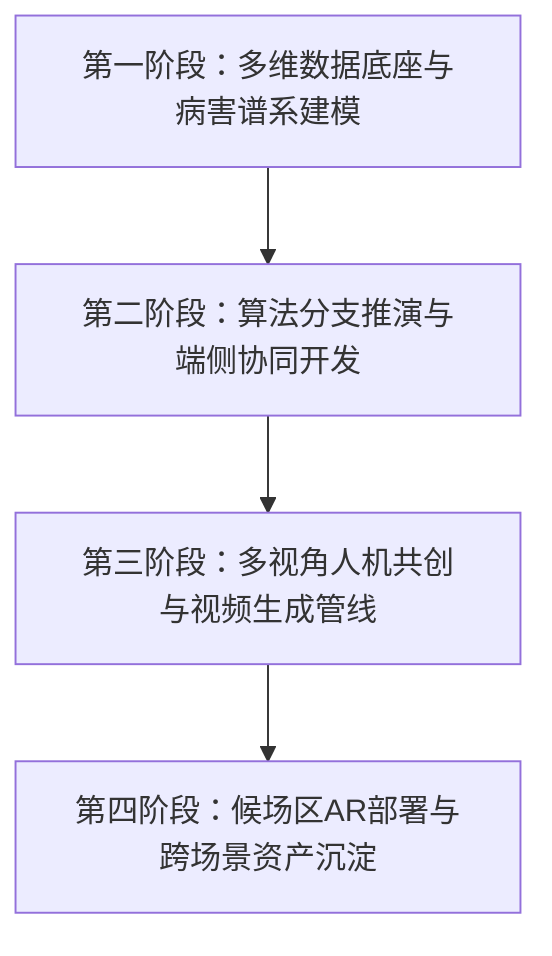

# 中华古籍与敦煌数字壁画智慧化服务平台
## 《云游壁画修复师与多视角人机叙事共创》专项实施方案

---

### 三、 实施步骤（Implementation Methodology）

本项目以**莫高窟第 257 窟（北魏 · 鹿王本生图与须摩提女因缘故事画）**为核心实体锚点，紧扣“云游壁画修复师”人机协同修复路径推演与“多视角人机叙事共创”两大创新机制，分四个阶段推进：

#### 1. 第一阶段：多维数据底座构建与病害谱系建模
* **超高清壁画数字化切片采集与多光谱数据对齐**：整理并提取莫高窟第257窟、320窟、321窟、322窟等核心洞窟的高精数字化测绘切片；结合紫外荧光、红外反射、X 射线荧光及拉曼光谱，构建多光谱对齐矩阵。
* **壁画物理病害多分类表征建模**：针对第257窟经典原迹，建模并构建**“矿物颜料氧化黑化（铅丹变色）”**、**“地仗层空鼓与起甲脱落”**、**“地仗层裂隙”**三大典型病害特征库。
* **敦煌学人文历史考据专家知识库搭建**：结构化整理北魏至盛唐时期的天然矿物颜料成分、绘制技法工序（如北朝凹凸晕染法与铁线描）、图像志构图惯例以及文物保护伦理（《威尼斯宪章》存真底线与最小干预原则）。

#### 2. 第二阶段：多算法分支生成与人机协同推演开发
* **构建 4 步高清图像修复流水线**：打通**“频域去网格（2D-FFT 陷波滤波） ➔ 图像去模糊（Restormer MDTA） ➔ 残差移位扩散超分（ResShift） ➔ 色彩保真校正（Reinhard Lab 空间对齐）”**完整管线，还原高清细节。
* **研发 U-Net 与扩散模型驱动的修复分支推演引擎**：针对病害实时生成 3 个不同技术假说的分支路径（激进全彩复原、原真性保留与最小干预、光谱虚拟回溯双镜对照），引入专家考据证据提示与用户校验打标。
* **开发“云游壁画修复师”移动端与网页端交互中枢**：开发微信小程序与 Web 端的大屏漫游展示，优化原生渲染性能，小程序端体积精简至 **1.43 MB** 确保秒开。

#### 3. 第三阶段：多视角人机叙事共创与短视频生成管线
* **第 257 窟《须摩提女因缘》故事画多局部拆解**：以北壁中段“须摩提女请佛”与“五百力士移山”为实体共创切片，调取大模型（LLM）与知识图谱自动生成佛教因果、女性命运社会史、图像学美术史 3 大视角的叙事草稿。
* **多模态叙事编辑与个性化语音合成**：提供可视化脚本编辑器，支持用户选择纪录片庄重、戏剧评书、学术科普等多语气风格进行语音合成（TTS）并渲染导出短视频。

#### 4. 第四阶段：候场区 AR 空间计算与推广部署
* **景区候场区 AR 虚实对照系统部署**：在候场区扫描导览图，即可在移动端触发壁画劣化现状与 AI 虚拟修复的虚实叠加视图，点击图案即可获取背后的故事解读，分流石窟停留时间。
* **结构化数字资产沉淀与版权确权**：沉淀带有人文校验标签的高清复原图像，形成“原始残缺图 → 算法分支图 → 最终校验复原图”的可溯源结构化数据链条。

---

### 四、 技术支撑（Technical Architecture & Support）

项目采用计算机视觉深度学习、多模态知识推理、轻量化移动端工程与空间计算技术：

| 技术维度 | 核心算法 / 技术选型 | 关键能力与应用场景 |
| :--- | :--- | :--- |
| **图像超清修复与分支推演** | Restormer (MDTA) ResShift (Diffusion) VQ-VAE / Reinhard | 去网格、去模糊、4~15步快速扩散超分，Lab空间色彩保真校正，构建多假设修复分支 |
| **大模型与多模态叙事** | DeepSeek-V3 / Qwen-2.5-VL CosyVoice / ChatTTS | 解析壁画题记与图像志知识图谱，驱动佛教/社会史/图像学3重视角草稿生成与多语气TTS配音 |
| **移动端与Web全栈工程** | 微信小程序原生 (WXML/JS) React 18 + TS + Vite 8 FastAPI 异步微服务 | 1.43MB 超轻量化移动端秒开，Web端100%~400%无级滚轮缩放与发光标点，GPU算力集群调度 |
| **空间计算与文保风控** | SLAM 空间几何对齐 HITL 人机协同校验链条 | 候场区AR虚实对照；严设文保伦理防线，沉淀“残缺图-算法分支图-校验复原图”可溯源数据链 |

#### 详细技术实现：
1. **Restormer（图像去模糊）**：基于高效 Transformer 架构，采用多深度卷积头变换注意力机制（MDTA）去除数字化扫描中的模糊与退化噪点；
2. **ResShift（扩散超分辨率）**：结合 VQ-VAE 将扩散模型采样压缩至 4~15 步快速采样，逼真重建矿物颗粒与微观起甲裂纹；
3. **Reinhard 算法**：在 Lab 空间匹配均值与标准差，彻底解决扩散模型修复带来的色偏；
4. **移动轻量化包体管控**：通过动态资源分包与精细化图片压缩，实现 1.43 MB 的超轻量包体，兼顾高清视觉与运行效能。

---

### 五、 预期效果（Expected Outcomes & Social Value）

本项目已打通了网页端沉浸大屏与微信小程序端人机协同推演环境。以下结合已部署落地的系统实测成果展示预期成效：

#### 1. 电脑端（Web）高精数字化建设成果
Web 端实现了 16:9 全景“云游敦煌”大厅，包含看壁画、看文物、看古建等悬浮交互（图 5.1）；支持第 257 窟壁画《九色鹿本生图》（图 5.2）与《须摩提女因缘图》（图 5.3）的超高清无级缩放与拖拽漫游，去除画面遮挡，点击半透明晶莹呼吸标点即可展开图像志深度解析。

*图 5.1 PC端“云游敦煌”悬浮交互大厅*

*图 5.2 莫高窟第257窟南壁《九色鹿本生经变》高清微观解析大厅*

*图 5.3 莫高窟第257窟北壁《须摩提女因缘》主室坐佛与五百力士移山解析大厅*

---

#### 2. 手机端（微信小程序）移动交互与人机协同成果
小程序端（图 5.4）成功集成了“云游壁画修复师”人机协同推演弹窗（图 5.5），支持用户诊断矿物颜料氧化黑化、推演 U-Net/扩散模型分支并打标校验。此外，小程序支持横屏壁画画廊模式（图 5.6、图 5.7），用户点击前部人字披屋顶、须摩提女燃香请佛等发光小点即可展开图像学考据。

*图 5.4 微信小程序端“云游敦煌”功能大厅*

*图 5.5 微信小程序端“云游壁画修复师 · 人机协同推演”病害诊断与算法分支比对*

*图 5.6 微信小程序端第257窟“全貌”人字披屋顶橡木结构图像学解析*

*图 5.7 微信小程序端第257窟“北壁”须摩提女燃香请佛图画解析*

---

#### 3. 预期社会效益与行业价值
* **技术突破与存真防线**：首创可溯源的人机协同修复数据链条，划定算法重建的应用边界，防止主观过度脑补破坏文物原真性；
* **高阶文保科普价值**：以游戏化推演引导公众深度理解“存真”、“最小干预”等核心原则，形成持续自生长的民间多视角阐释数据库；
* **景区运营与资产活化**：候场区 AR 前置导览分流，预计可缩短实体石窟内 15%~20% 的停留时间，显著缓解石窟承载红线；校验沉淀的高精度复原线描与图样，直接转化为具备清晰确权的标准数字母版库；
* **跨场景示范迁移**：标准化“图像净化 + 算法分支推演 + AR 虚实对照 + 多视角叙事”全套模块，可无缝向全国各大石窟寺及古代壁画遗址推广。
